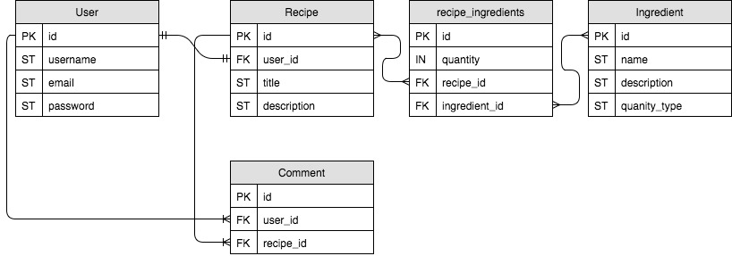

# README

### ERD

### User Stories
##### Guest
* As a guest I want to be able to browse recipes
* As a guest I want to be able to sign up for an account
* As a guest I want to be able to login

##### Authenticated User
* As an Authenticated User I want to be able to logout
* As an Authenticated User I want to be able to change password
* As an Authenticated User I want to be able to edit my profile
* As an Authenticated User I want to be able to create a Recipe
* As an Authenticated User I want to be able to see my recipes
* As an Authenticated User I want to be able to edit my recipes
* As an Authenticated User I want to be able to publish my recipes
* As an Authenticated User I want to be able to delete my recipes
* As an Authenticated User I want to be able to favorite recipes
* As an Authenticated User I want to be able to be able to comment on recipes
* As an Authenticated User I want to be able to be able to see when someone has commented on my recipe

##### Admin User
* As an Admin User I want to be able to logout
* As an Admin User I want to be able to change password
* As an Admin User I want to be able to view analytics/information
* As an Admin User I want to be able to delete recipes of all users
* As an Admin User I want to be able to delete comments of all users
* As an Admin User I want to be able to disable comments for recipe

